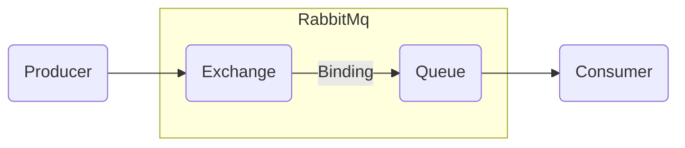

## 2장 내용 정리
### 0. RabbitMQ

### 1. Exchanger
- Direct :: Routing Key 와 정확히 일치하는 Queue 로 메시지 전달
- Fanout :: 연결된 모든 Queue에 메시지 전달, Routing key는 무시된다.
- Topic :: Routing Key 와 패턴을 이용하여 일치하는 Queue 로 메시지 전달
- Headers :: 메시지 헤더에 속성 값을 사용하여 메시지 전달하는 방식, 메시지의 Routing Key는 무시된다.

### 2. Queue
- 메시지가 최종적으로 도달하는 곳
- Consumer가 메시지를 소지할 때까지 메시지를 보관

### 3. Binding
- Exchange 와 Queue 간의 연결을 정의
- Binding 에서는 어떤 Queue에 어떤 Exchange와 Routing Key를 이용하여 메시지를 전달할지 지정한다.
  - ex) BindingBuilder.bind(`{{QUEUE}}`).to(`{{EXCHANGE}}`).with(`{{ROUTING_KEY}}`); 

## 과제(1)

1. Configuration 클래스 파일 만들기
    1. command, user, room Queue 만들기
    2. 패턴과 Routing Key를 이용한 Topic Exchange 만들기
    3. 1과 2를 이용하여 Binding 구성
