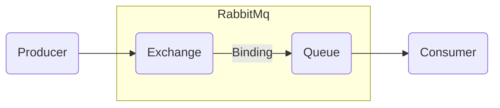

## 2장 내용 정리

  
2장 내용 정리

  
### 0. RabbitMQ

### 1. Exchanger
- Direct :: Routing Key 와 정확히 일치하는 Queue 로 메시지 전달
- Fanout :: 연결된 모든 Queue에 메시지 전달, Routing key는 무시된다.
- Topic :: Routing Key 와 패턴을 이용하여 일치하는 Queue 로 메시지 전달
- Headers :: 메시지 헤더에 속성 값을 사용하여 메시지 전달하는 방식, 메시지의 Routing Key는 무시된다.

### 2. Queue
- 메시지가 최종적으로 도달하는 곳
- Consumer가 메시지를 소지할 때까지 메시지를 보관

### 3. Binding
- Exchange 와 Queue 간의 연결을 정의
- Binding 에서는 어떤 Queue에 어떤 Exchange와 Routing Key를 이용하여 메시지를 전달할지 지정한다.
  - ex) BindingBuilder.bind(`{{QUEUE}}`).to(`{{EXCHANGE}}`).with(`{{ROUTING_KEY}}`);

### MEMO
1. RabbitAdmin 을 이용하여 동적으로 Queue, Binding, Exchange 생성 및 제거 가능

## 과제(1)

1. Configuration 클래스 파일 만들기
    1. command, user, room Queue 만들기
    2. 패턴과 Routing Key를 이용한 Topic Exchange 만들기
    3. 1과 2를 이용하여 Binding 구성

## 3장 내용 정리

### 0. RabbitMQ 인증
- 클라이언트가 RabbitMQ에 접속 시 인증 및 인가(configure, write, read)에 사용
- 기본적으로 RabbitMQ의 자체 DB를 이용하여 인증
- 플러그인 활성으로 다른 방법의 인증이 가능하며, 백엔드는 여러 인증 방법을 지정할 수 있다.

### 1. 지원하는 인증 백엔드
- Internal
- OAuth2
- LDAP
- HTTP
- Cache

## 과제(2)

1. HTTP 인증을 사용하여 권한 제한하기
    1. vhost "chat" 으로의 접근만 허용
    2. "request" exchange에 보내기(publish) 허가
    3. "user.[자신의 아이디]" 이름으로 큐 생성 허가
    4. "user.[자신의 아이디]" 큐를 "user" exchange에 "chat.user.[자신의 아이디]" routing key로 바인딩 허가
    5. "user.[자신의 아이디]" 큐에서 읽기 허가
    6. 이외의 요청은 모두 거부
> **Client 가 Request Exchange에 Routing Key가 "chat.user.[자신의 아이디]"인 메시지를 보내서 user-[자신의 아이디] 큐로 받을 수 있어야 함.**

